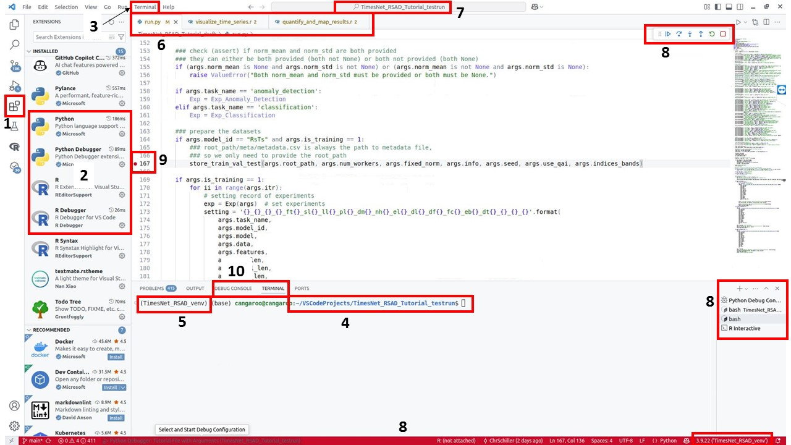
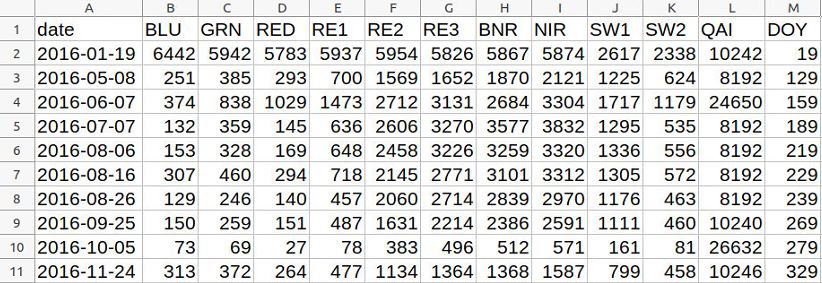
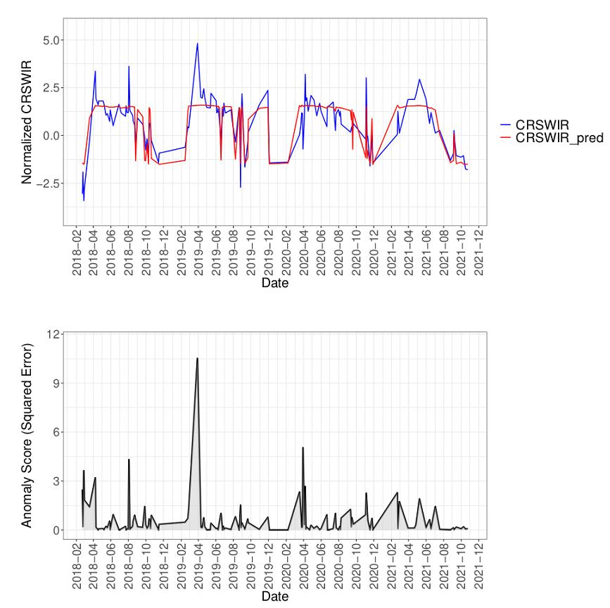
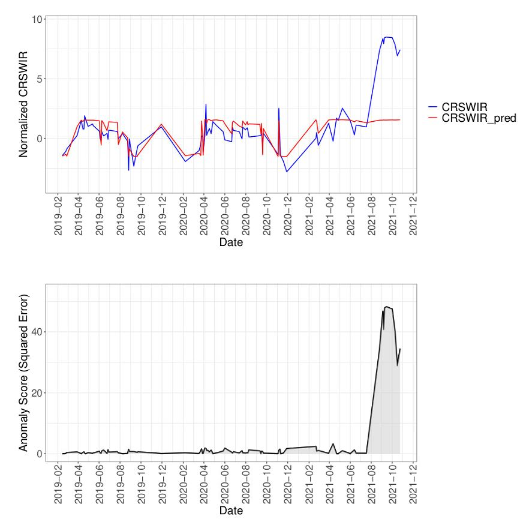
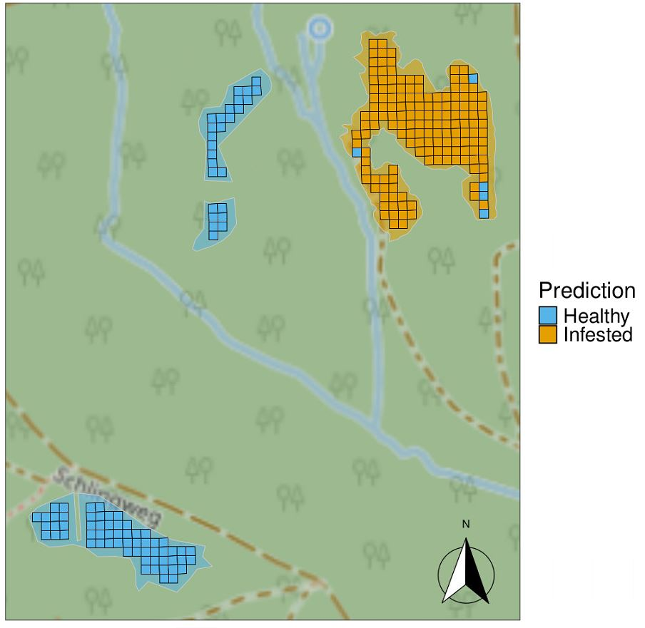
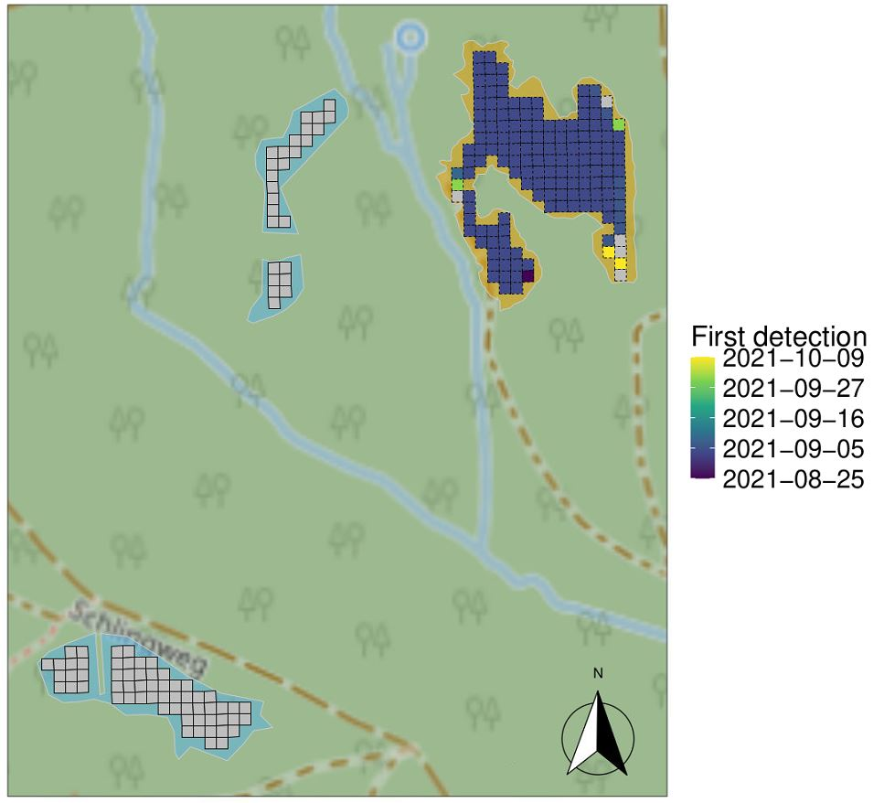

# Tutorial on Anomaly Detection using TimesNet RSAD on Sentinel-2 Time Series

## General Introduction 

Dear students, 

welcome to this tutorial about the training and inference of the Deep Learning TimesNet RSAD model from scratch.  
This tutorial is strongly based on the TimesNet RSAD repository from Schiller et al. (2025), which in turn is strongly based on the TimesNet model from Wu et al. (2022). The repositories can be found here (https://github.com/ChrSchiller/TimesNet_RSAD) and here (https://github.com/thuml/TimesNet). 

This tutorial will cover all steps from setting up a Python environment, downloading the dataset, training, testing, and evaluating the network. The final output will be the Sentinel-2 pixels of a few disturbed and undisturbed example polygons including the time of disturbance detection.

The bad news is: you will need to use the command line.  
The good news is: I will provide all the commands needed, and there are not many. I will also outline where exactly potential adjustments have to be made to get to the results. 

This tutorial has been tested on a Linux Ubuntu 20.04 LTS machine with an Nvidia RTX A6000 GPU and CUDA version 12.2 on 2025-06-02. I provide Windows commands where necessary in case they differ from the Linux commands. One important note about that: Windows commands use backslashes (the `\` symbol) instead of slashes (the `/` symbol) for paths. So if you are on Windows and encountering any errors, first thing to try is to double-check on the correct path given (though I've read that modern Windows versions are quite forgiving and might interpret it correctly anyway). 

## Purpose and Principal of the Model

First things first: What is the purpose of the model?

(You may skip this chapter if you're not interested in the background/purpose of the model, and only want to apply it.)

This tutorial is an introduction to the TimesNet RSAD (RSAD = "Remote Sensing Anomaly Detection") model. The model was developed to identify anomalies in time series of the Sentinel-2 (S2) satellite, which can then be interpreted as disturbances. Specifically, the goal of this model is early detection of bark beetle infestations. These infestations led and will lead to large-scale Norway Spruce (*Picea abies* L.) dieback in Central Europe, and are difficult to detect as visible symptoms of dieback only occur between one and six months after the infestation. An early detection is crucial for forest managers to prevent further spread of the beetle, which breeds in the trees, with its brood swarming out after about ten weeks to attack another tree. The goal is to log and remove the tree within ten weeks after the infestations.  
The established near real-time (NRT) monitoring algorithms using satellite image time series produce many false positives as they are prone to respond to outliers in the naturally noisy S2 time series (think of clouds, cloud shadows, etc.). On the one hand, the advantage of these algorithms is that they only need to cope with the variability of the single pixel each model is fitted to, which can make them sensitive to small deviations and thus enable early detections. On the other hand, the approach of TimesNet RSAD is to learn the natural variability in undisturbed (in our case: not infested by bark beetles) S2 time series on a large dataset, and then checks for deviations on any new time series. This avoids false positives. 

The basic idea of the reconstruction-based time series anomaly detection approach used here is as follows: 
For training, the model input are multi-year time series (here: Sentinel-2 satellite) stored in csv files. These training time series are sampled exclusively from forest pixels that did **NOT** show any disturbance, hereafter referred to as 'undisturbed time series'. The model learns to reconstruct these (usually irregular) time series as close as possible. As the model was only trained on undisturbed time series, it never learned to reconstruct time series of disturbed forest ('disturbed time series'). Hence, it will fail to do so, and the evolving anomaly can be measured as the difference between observation and reconstruction/prediction. 

## Outline of the Tutorial

This tutorial is divided into the following chapters, which will guide you through the whole process

- Chapter 1: Installing and Setting up an IDE (here: VS Code)
- Chapter 2: Acquiring the code
- Chapter 3: Setting up the Python Environment
- Chapter 4: Acquiring the Dataset
- Chapter 5: Overview of the Workflow
- Chapter 6: Overview of the Main Building Blocks of the TimesNet RSAD Code Repository
- Chapter 7: Applying the Deep Learning Code
- Chapter 8: Model Training
- Chapter 9: Model Inference for a Set of Time Series (without prior Training)
- Chapter 10: Visualizing the Results
- Chapter 11: How to Improve the Results
- Chapter 12: Model Inference for a whole FORCE Tile for a specific Time Frame
- Chapter 13: References and Acknowledgments

## Chapter 1: Installing and Setting up an IDE (here: VS Code)

My favorite IDE for writing and using code is Visual Studio Code (VS Code). Its advantage is that both R and Python can be used seamlessly including very powerful debuggers, and it is still free of charge (although a proprietory product from Microsoft Corp.). Here's how you can download and install it: 

On Linux and Windows, you can download VS Code from the [official website](https://code.visualstudio.com/) and double-click the .deb (Linux Ubuntu) or .exe (Windows) file. On Windows, make sure to check the box 'Add to PATH' (or similar) during the installation to make it accessible from the command line. Throughout the tutorial, I will assume you're on Linux, but provide the relevant Windows commands and some Windows-specific information if necessary as well. 

Once VS Code is installed, you will need to install R and Python language support (so-called 'Extensions' in VS Code). Open VS Code, click on the 'Extensions' symbol on the toolbar on the left panel (Fig. 1 (1)), search for 'R' and 'Python' and install the corresponding extensions (including their debuggers, if desired; cp. Fig. 1 (2)). Note that the other highlighted sections in Fig. 1 will be mentioned in the following chapters. 



Figure 1. Basic layout and functions of VS Code with activated virtual environment and installed extensions for R and Python including their debuggers. 

Afterwards, open up a new terminal (e.g. by clicking 'Terminal' -> 'New terminal' in the upper control panel (Fig. 1 (3))). We will work mainly using the terminal throughout the entire project.

## Chapter 2: Acquiring the Code

Install git if necessary (should work using `sudo apt install git` in any Linux and `winget install --id Git.Git -e --source winget` in any Windows terminal) and clone the repository to a folder of your choice by moving to the parent directory in the terminal:  
Your terminal will show a file path when opened up (Fig. 1 (4)). You can move to the next sub-directory by typing `cd [subdirectory_name]`, and to the parent directory by `cd ..`, followed by pressing `Enter` on the keyboard. The `ls` command lists all the files and directories in the current directory (useful for orientation). 
Once you've arrived at, for instance, `home/user/VSCodeProjects`, clone the repository using git like this: 

```bash
git clone https://github.com/ChrSchiller/TimesNet_RSAD_Tutorial.git
```

This command will create a directory `TimesNet_RSAD_Tutorial` in the active directory of your terminal, so make sure to move your terminal to the correct folder beforehand, e.g. `home/user/VSCodeProjects`. 

Alternatively, you can download the full repository (and our example dataset, see below) here:  
[Download files](https://drive.google.com/drive/folders/1j2ROJhZog9Thcp_EL8k2CJYG4fm3Y_k-?usp=sharing)

I recommend to use `git clone` to familiarize yourself with git, which is an essential tool for version control in code-intense research. 

## Chapter 3: Setting up the Python Environment

The tutorial uses both R and Python. It is assumed that R is installed already. Note that during the tutorial, the R scripts executed will automatically detect R packages that are needed but not installed on your system and install them. 

It is common for Python users to utilize so-called 'virtual environments'. Think of it as a 'safe space' for your project-related Python version and packages. Whatever python version and package you install or uninstall in this environment affects only the environment, not the whole computer. If you, for instance, work on a computer that is shared by many students, this is very handy. When everyone is strictly working in his/her own environment, nobody will screw up your dependencies (e.g. updating packages that will lead to package conflicts in YOUR work). It is also a good way to document and recover a set of packages (more importantly, package versions) that are known to work on the code you want to use. That is why we use a python environment here as well. I will show you how to set it up and use it in the following. 

Firstly, we create and activate a virtual environment with 'venv' using Python 3.9. Execute the following code in your terminal if Python 3.9 is not installed on your computer yet: 
```bash
sudo apt install python3.9 python3.9-venv
```

Note that you need admin rights on your computer and have to provide your password if installing new software (such as Python 3.9).
Also note that we assume that your terminal is currently running in the main project directory. This should be the case if you followed the above instructions, but you can check it directly in your terminal (see Fig. 1 (4)). If necessary, navigate to that location using `cd /path/to/your/main/project/folder`. If you start the file path with the `/` symbol (as in the latter example), you can do this no matter where the terminal cursor currently is, because then it is an absolute path. 

Now create the environment in your project directory: 
```bash
python3.9 -m venv TimesNet_RSAD_venv
```

`TimesNet_RSAD_venv` is now the name of your virtual environment (choose any name that makes sense to you, or stick to my suggestion). Activate it as follows: 

```bash
source TimesNet_RSAD_venv/bin/activate
```

Note that there should be the name of your environment in brackets before the command line in your terminal now (see Fig. 1 (5)). 

In case you want to deactivate your environment, simply type and execute `deactivate` in the terminal.

Since you have cloned the TimesNet_RSAD_Tutorial repository already, you might have noticed the `requirements.txt` file in the main project folder. This is a simple text file that contains the required package names and versions. We will use pip to automatically install all of them into your environment. Make sure you have activated your environment beforehand (environment name in parentheses in terminal, see above).  
pip is a package manager specifically for Python. It facilitates the installation of Python packages and required versions. An alternative would have been Anaconda, which is often used as well, and can be used with R and other programming languages. We stick to pip here, because it is more light-weight than Anaconda and fully satisfies our needs. In the unlikely event that pip is not pre-installed on your computer, use `sudo apt install python3-pip`.
For the installation process, we only need to execute the following command and keep our fingers crossed until it is finished (again, assuming your terminal's cursor is in the main project directory): 

```bash
pip install -r requirements.txt
```

If errors occur during the installation process, try to fix them using the hints and suggestions by pip, which are usually very helpful.

If you are using Windows, the equivalent code for all the commands explained above is the following.
Note that lines starting with the `#` symbol should not be executed - these are comments that provide further explanations about what the actual code is doing. 

```bash
# Python 3.9 can be downloaded from the official Python website (URL accessed on 2025-06-03): https://apps.microsoft.com/detail/9p7qfqmjrfp7?hl=en-EN&gl=EN
# and installed by double-clicking the downloaded file
# this will also include an installation of pip

# navigate to folder (backslashes on Windows)
cd path\to\main\project\folder
# create python environment
python -m venv TimesNet_RSAD_venv
# activate the environment
TimesNet_RSAD_venv\Scripts\activate
# install python packages from requirements file (identical to Linux command)
pip install -r requirements.txt

# if you ever want to deactivate the environment, do it as follows 
# (just as additional info, not part of the workflow; identical to Linux command)
# deactivate
```

## Chapter 4: Acquiring the Dataset

As described above, the necessary input to the model are undisturbed time series for training and both undisturbed and disturbed time series for testing. Such a dataset is provided [under this Google Drive link](https://drive.google.com/drive/folders/1j2ROJhZog9Thcp_EL8k2CJYG4fm3Y_k-?usp=sharing) and called 'dataset.zip'. Just unzip the downloaded zip document and make sure that the final path is `[...]/TimesNet_RSAD_Tutorial/dataset/[meta directory and csv files]`

What follows is a quick description of the provided dataset:  
The time series of each pixel are stored as `.csv` files (each pixel one file; see Fig. 2 for an excerpt of one example file) containing 13 comma-separated columns: date, BLU, GRN, RED, RE1, RE2, RE3, BNR, NIR, SW1, SW2, QAI and DOY. date is the calendar date of observation, followed by the ten S2 bands that can be used. QAI contains the quality assurance information as an integer value, and DOY is the cumulative day of the year, meaning that in the first year it ranges from 1 to 365, in the second year from 366 to 730, and so on. The DOY is cumulative mainly because this makes it easier for the program to separate the years for further processing (as the date column is only used in the visualization script after applying the model). The 10 S2 bands are used internally by the program to acquire the used vegetation indices, if desired. To find out how exactly these data are acquired, I refer you to the original paper (Schiller et al., 2025) and the corresponding [Github repository](https://github.com/ChrSchiller/TimesNet_RSAD).  
The dataset contains two sub-datasets: `lux` and `may` (denoted by the dataset column in the file metadata.csv in `path/to/your/main/project/folder/TimesNet_RSAD_Tutorial/dataset/meta/metadata.csv`). The coniferous forest pixels of `lux` are those used in Schiller et al. (2025), but we provide pixels from deciduous forest here as well. They can be separated by the `frac_coniferous` column in `metadata.csv` (`frac_coniferous` == 1 means coniferous pixel, 0 means deciduous, anything between means mixed).  
When reading the paper, you will notice that the model in the paper is trained on more data. For the purpose of this tutorial, I wanted to keep the training dataset smaller. The other dataset, `may`, is a subset of the test data from the mentioned paper. It comprises all pixels of the largest polygon used in testing, located in the Arnsberg Forest in North Rhine-Westphalia (NRW), Germany, and three undisturbed polygons nearby. This area was heavily infested by bark beetles during and after the hot drought events of 2018 until 2020. It is, thus, a perfect location for testing our disturbance detection model!  
As these csv files don't carry any spatial information, you will find more files in the meta directory called `val_pixels.gpkg` and `val_polys.gpkg`. It will be used to put the results obtained from the model onto the map later on (Chapter 10). 



Figure 2. Excerpt of example time series file used as model input. 

The downloaded dataset is ready to be ingested by the model right away. As said, I suggest to move it into the directory `path/to/your/main/project/folder/TimesNet_RSAD_Tutorial/dataset`, so that the meta file can be found in `path/to/your/main/project/folder/TimesNet_RSAD_Tutorial/dataset/meta/metadata.csv`. If done so, the following commands can be used without much adaptation.

## Chapter 5: Overview of the Workflow

The general workflow of this tutorial is the following: 

1) get the data and set up the project
2) train the model
3) run model inference
4) calculate and apply the threshold ro return the detection date (or no detection)
5) join the detection date (if any) to spatial object
6) plot results on map

We have just finished step 1), as we should have the dataset in a known location at this point. This is one of the most time-consuming parts in applied research, which I spare you for this tutorial.  
Now we are ready for step 2, which can be (and will be in this tutorial) combined with step 3 (obtaining the predictions). Afterwards, we will leave the realm of Python and turn to R for the post-processing (steps 4 to 6). Note that of course this could have been coded in Python as well, but the creator of this tutorial is a long-term R user and so it felt more convenient to do it in R. 

Before actually moving forward in the workflow, we will have a closer look at the most important scripts in the Deep Learning workflow in the next chapter. 


## Chapter 6: Overview of the Main Building Blocks of the TimesNet RSAD Code Repository

The questions of this chapter are: What will the model training code actually do? What are the main functions used in the code?

Let's be honest: there is a lot of Python code in this repository and it seems very complicated and overwhelming. Therefore, I want to show you only the most important functions and scripts to roughly understand what is going on under the hood, while sparing you the details. The most important code is found in: 
- `run.py` in the main directory
- `store_train_val_test` function in `./utils/store_train_val_test.py` (the `.` symbol means 'current directory', which means the main project directory in this case)
- `RsTsLoader` class in `./data_provider/data_loader.py`
- `exp_anomaly_detection` in `./exp/exp_anomaly_detection.py`
- `Model` class in `./models/TimesNet_RSAD.py`

We will now go through these scripts together and try to understand them. Let's go!

### run.py

`run.py` is the entry point to the Python code. Its main function is to 'collect' the information given to it by argument parsing (for more on this, see next chapters) and distributing them to the following scripts.  
Accordingly, a large part of `run.py` looks like this (again, note that the `#` symbols are comments to support understanding, and not code): 

```python
parser = argparse.ArgumentParser(description='TimesNet')

# basic config
parser.add_argument('--task_name', type=str, required=False, default='anomaly_detection',
					help='task name, options:[anomaly_detection]')
parser.add_argument('--is_training', type=int, required=False, default=1, help='training required? 0 = No, 1 = Yes')
parser.add_argument('--is_testing', type=int, required=False, default=1, help='testing desired? 0 = No, 1 = Yes')

### [...]

### parse the arguments
args = parser.parse_args()
```

The arguments passed to `run.py` are collected and stored in a dictionary called `args` here.  
Note the many variables with `required=False` and/or an allocated default value. You can pass these arguments optionally to the script, if you're not happy with the default. For instance, if you're not happy with the default value of `num_kernels` (8), which determines the size of the model (among other parameters), you can pass a different value (e.g. 4) explicitly using `--num_kernels 4`. If you're happy with the value, don't provide the argument, and the default will be used.  
The advantage of argument parsing is that most users will not have to change anything in the code, and you can easily pass all the arguments to any function in the entire codebase by just passing the `args` dictionary. 

Think of the whole processing chain as different layers: `run.py` is the first layer, which itself executes other scripts such as `store_train_val_test` function as second layers. Within those functions, a new function/method can be executed, which would then be a third layer (delving deeper into the code). 
In `run.py`, depending on the value of the `--is_training` argument (0 for No and 1 for Yes), the function `store_train_val_test` is invoked, which prepares the datasets for model training (see next sub-chapter). Afterwards, the train or test methods of `exp_anomaly_detection` are executed, depending on the `--is_training` and `--is_testing` arguments' values. The acceptable values are usually defined by the `type` argument and possibly some additional information in the `help` argument. To get all information about which arguments exist and how they can be used, run `python run.py --help` (in the main project directory, or provide the absolute path to the `run.py` file in the latter command, e.g. `python /path/to/main/project/directory/run.py --help`). 

### store_train_val_test

This function prepares the datasets in a final pre-processing step to be ready for model processing. It mainly separates training, validation and test datasets, and then stores their file names in separate files, so that a data leak from test to train dataset is excluded by all means.  
In Deep Learning, we usually need three datasets: the training dataset is exactly what you would expect - the model uses these time series to adjust its 'weights' (where the 'knowledge' of the model is stored), i.e. it learns from them. The validation dataset is used to monitor the progress of the training process. This is essential to avoid overfitting of the model to the training data. If that happens, the performance on the validation dataset stalls and thus, the training can be stopped ('early stopping'). The test dataset is again what you would expect - this is a hold-out dataset for model evaluation, in our case purposedly geographically far away from the other datasets. 

Here is a code snippet of the main part with comments: 

```python
### read metadata
meta = pd.read_csv(root_dir + '/meta/metadata.csv', sep=",")

### [...]

### define testdat as all meta rows from the May dataset
testdat = meta.loc[(meta['dataset'] == 'may')] 

### [...]

### select only the rows from the lux dataset for training/validation
meta = meta.loc[(meta['dataset'] == 'lux')] 

### [...]

### split the data into training and validation datasets
traindat, valdat = train_test_split(meta, test_size=.2, random_state=seed)
```

Currently, the `store_train_val_test` function uses only coniferous forest pixels for training, as we want to keep the natural variability of the undisturbed training time series as low as possible in order to be more sensitive to small spectral changes, which would then enable early infestation detection. The dataset provided, however, contains pixels of deciduous and mixed forest as well, so you can play around with that or adapt it to your use case. For instance, you might want to test the model on a dataset of deciduous forest. In this case, just comment out (put a '#' symbol before the code) the following code lines, which essentially removes all but the purely coniferous pixels: 

```python
### remove all frac_coniferous != 1 observations from meta
### this could be changed by commenting out -> all forest types (including deciduous) would be used
meta = meta.loc[meta['frac_coniferous'] == 1]
```

In case you want to use your own dataset in this tutorial, this function very likely needs some adjustments!


### exp_anomaly_detection.py

This is the main method that takes care of executing the data loader (which is an efficient way of reading and preparing the data for the model, see next sub-chapter) and feeding the model in a loop over the intended epochs. In each epoch, the whole training dataset is provided to the model for training once. This is repeated again and again, until the number of epochs are reached or the model does not improve anymore ('early stopping'). 
Accordingly, the main methods of `exp_anomaly_detection.py` are: train and test. These methods are executed in `run.py` - can you find where?

Let's have a look at an excerpt of the `train` method in `exp_anomaly_detection.py` (see below). The script first defines the `Exp_Anomaly_Detection` class. In the class, several 'methods' are defined, e.g. `train` (as in the example below). The `train` method starts with preparing the data pipeline using the `_get_data` method (which is defined for this class). Note that the data is NOT prepared by this code. It only initializes the 'pipeline' to do so, using the `DataLoader` (see next chapter). To actually pull a batch of data, we would have to invoke it, which is done later.  

```python
### class definition for anomaly detection experiment
class Exp_Anomaly_Detection(Exp_Basic):

    ### [...]

    ### train method definition
    def train(self, setting, model_id=None, pretrained=False, base_path="."):
        ### this is the sample time series preparation code
        train_data, train_loader = self._get_data(flag='train')
        vali_data, vali_loader = self._get_data(flag='val')
        test_data, test_loader = self._get_data(flag='test')
```

Afterwards, you will find a for loop that actually draws a batch from the `DataLoader` and then feeds it to the model (the second for loop in the snippet below). The model does a forward pass to produce an output, which is then quantified by the loss (the mean squared error between observations and reconstructions). This loss is used for the 'backward pass' for optimization of the weights of the model. 
After each epoch, the loss is computed on the validation dataset with the current model (i.e., using the model weights AFTER this epoch's optimization steps).

```python
### for loop over epochs
for epoch in range(self.args.train_epochs):

    ### [...]

    ### for loop over batches of data within an epoch
    for i, (batch_x, batch_x_mark) in enumerate(train_loader):

        ### [...]

        ### get outputs from the model (this is the forward pass)
        outputs = self.model(batch_x, batch_x_mark, None, None)

        ### calculate loss
        loss = criterion(outputs, batch_x)

        ### [...]

        ### backward pass and optimization
        ### this is the backpropagation step
        loss.backward()
        model_optim.step()

    ### [...]

    ### compute loss on validation dataset after each epoch
    vali_loss, single_losses = self.vali(vali_data, vali_loader, criterion, model_id)
```

Let's compare this to a simplified snippet of the corresponding test method:

```python
### test method definition
def test(self, setting, model_id=None, test=0, indices_bands=[]):

    ### get validation and test data and DataLoaders ready
    test_data, test_loader = self._get_data(flag='test')
    vali_data, vali_loader = self._get_data(flag='val')

    ### statistic on the vali set
    ### for loop over batches of data in validation dataset
    for i, (batch_x, batch_x_mark) in enumerate(vali_loader):

        ### [...]

        ### reconstruction
        outputs = self.model(batch_x, batch_x_mark, None, None)

        ### [...]

    ### for loop over batches of data in test dataset
    for i, (batch_x, batch_x_mark) in enumerate(test_loader):

        ### [...]

        ### reconstruction
        outputs = self.model(batch_x, batch_x_mark, None, None)

        ### [...]
```

Looks pretty familiar, doesn't it? Again, we initialize the `DataLoader` and loop through the batches of data. In the first loop, we acquire the reconstructions of the trained model on the validation dataset and quantify them by MSE. This is needed for the automated thresholding later. The second loop generates the reconstructions of the test dataset's time series, which we need for the analysis. 
In the next step, we will have a closer look at the `DataLoader` class. 

### RsTsLoader (the DataLoader)

The `DataLoader` class, here called `RsTsLoader` ('Remote Sensing Time Series Loader') and located in `./data_provider/data_loader.py`, uses the training, validation and test samples provided by the `store_train_test_val` function and applies some final preprocessing before the model gets to see the time series. Find below simplified code snippets that show the RsTsLoader and the described functionality, especially the `__get_item__` method of the `RsTsLoader` class. 

```python
class RsTsLoader(Dataset):

    ### [...]

    ### method that reads, prepares and outputs a single sample time series (here: csv file)
    def __getitem__(self, idx):

        ### [...]

        ### read the csv file
        X = pd.read_csv(X_name, sep=',', usecols=collist)

        ### [...]
```

Processing involves removing the observations that fail the quality screening (using the QAI column), e.g. because of over- or undersaturation, high likelihood of a cloud or cloud shadow, and so on. 

```python
        ### use QAI column to filter good quality observations
        if self.use_qai == 1:

            ### [...]

            ### convert QAI column (integer) to 15-bit binary
                    X['QAI_binary'] = X['QAI'].apply(lambda x: format(x, '015b'))

            ### [...]

            ### remove rows with the following features: 
            ### valid == 1, cloud == 10 or 11, cloud_shadow == 1, snow == 1, water == 1, aerosol == 10 or 11, 
            ### subzero == 1, saturation == 1, high_sun_zenith == 1, illumination == 10 or 11
            X = X[(X['valid'] == "0") & 
                (X['cloud'] != "10") &
                (X['cloud'] != "11") & 
                (X['cloud_shadow'] == "0") & 
                (X['snow'] == "0") & 
                (X['water'] == "0") & 
                (X['aerosol'] != "10") & # 'high (aerosol optical depth > 0.6, use with caution)' -> could be used
                (X['aerosol'] != "11") & 
                (X['subzero'] == "0") & 
                (X['saturation'] == "0") & 
                (X['high_sun_zenith'] == "0") & 
                (X['illumination'] != "10") & # 'poor (incidence angle > 90°, low quality for topographic correction)' -> could be used
                (X['illumination'] != "11") 
            ]

            ### [...]
```

Vegetation indices are computed, if desired: 

```python
        ### list of indices to check
        indices_to_check = ["DSWI", "NDWI", "CLRE", "NDREI2", "NDREI1", "SWIRI", "CRSWIR", "NGRDI", "SRSWIR", "LWCI"]
        if any(index in self.indices_bands for index in indices_to_check):

            ### [...]

            if "CRSWIR" in self.indices_bands:
                ### compute the CRSWIR index by following equation
                X['CRSWIR'] = X['SW1'] / (X['NIR'] + ((X['SW2'] - X['NIR']) / (2185.7 - 864)) * (1610.4 - 864))

            ### [...]
```


The RsTsLoader also normalizes the time series (e.g. by 'fixed normalization', the default) and applies 'data augmentation' on the training data. Data augmentation is a technique to avoid overfitting by altering the values or some features of the input training data a bit so that the model never sees the very same sample twice. It is regularly used in Deep Learning, as overfitting is one of the main challenges of this technique. 

```python
        ### NORMALIZATION
        ### check if fixed normalization parameters should be used
        if self.fixed_norm == 1:
            columns_to_normalize = [col for col in X.columns if col != 'DOY']
            X[columns_to_normalize] = X[columns_to_normalize].apply(lambda x: (x - self.overall_mean) / self.overall_std, axis=1)

        ### [...]

        ### DATA AUGMENTATION
        ### add some time series augmentation (data augmentation) procedures
        ### but only for the train dataset
        if self.flag == "train":

            ### randomly jitter the DOY values by +/- 5 days (to simulate phenological differences)
            if np.random.rand() > 0.5:  # 50% chance to proceed with DOY jitter
                ### get random integers between +/-3 for all doy values
                doy_noise = np.random.randint(-3, 3, ts[:, -1].shape[0])
                ### get min and max before doy jitter (should not be changed, e.g. to avoid negative doy values)
                minimum = ts[:, -1].min()
                maximum = ts[:, -1].max()
                ### add the noise to the doy values
                ts[:, -1] += doy_noise
                ### clip to keep the correct range
                ts[:, -1] = np.clip(ts[:, -1], minimum, maximum)

            ### [...]
```

The RsTsLoader also reformats the time series so that it can easily be divided into four single year time series (4 times 1 year) instead of one time series of four years length (1 times 4 years). I spare you the complicated code, but remember this when reading through the next chapter (specifically the `TimesBlock` part) - this will strongly support your understanding!

Note that if you're using your own dataset (and not the provided one) in this tutorial, you might have to change some parts of `RsTsLoader` (e.g. different encoding of QAI flags if S2 preprocessing has not been done using FORCE, longer time series, ...). 

### TimesNet_RSAD model class

This is the heart of the code: the model itself. Note that the model is rather complicated and our changes to it (to make it fit for irregular time series) didn't make it easier either, so I will describe it as simple as possible. A general understanding will be enough for the time. 

The model itself is defined in the `Model` class in `./models/TimesNet_RSAD.py`. After initialization of a model instance in the `__init__` method, the `anomaly_detection` method is defined. The for loop runs through the layers of the model, each one containing `d_model` times `num_kernels` kernels. Afterwards, a dense layer is used for the actual reconstruction step, once the convolutional kernels have scanned through the input. The `forward` method actually applies these operations. 

```python
class Model(nn.Module):

    ### initialization of the class
    def __init__(self, configs):

    ### [...]

    ### defining the anomaly detection workflow
    def anomaly_detection(self, x_enc, x_mark_enc): 

        ### for loop through the model layers
        for i in range(self.layer):

            ### project back
            dec_out = self.projection(enc_out)

    ### apply the operations defined above to the input data
    ### this is the forward function that is executed when the model is called
    ### it is the main entry point for the model, where the input data is passed through the model
    def forward(self, x_enc, x_mark_enc, x_dec, x_mark_dec, mask=None):

        ### this is the "real" forward function that passes the input data for the model
        ### it is what is being executed when executing self.model(...)
        if self.task_name == 'anomaly_detection':
            dec_out = self.anomaly_detection(x_enc, x_mark_enc)
            return dec_out  # [B, L, D]

    ### [...]
```

The model's layers are mainly `TimesBlock`s, which are the main innovation of the TimesNet model. The idea is that convolutional layers (the main building blocks of Deep Learning-based computer vision models called 'Convolutional Neural Networks', or 'CNNs') are used over a) the temporal dimension (along the temporal axis, capturing the 'intraperiod variation') and b) the different 'periods' (along the time series axis, capturing the 'interperiod variation') simultaneously.  
Remember that the `RsTsLoader` prepared to smoothly separate the multi-year time series into a set of single-year time series? This is applied here! It basically adds one dimension, here the second one (`length // period`), which will evaluate to 4 (length == 200 and period == 50). We defined the `period`, which stands for all observations of one year, as 50, because it is hardly possible to get more than 50 (suitable) observations per year. Accordingly, instead of one time series with 200 observations (many of them being 0 because of padding), we now have 4 time series (years) with 50 (party padded) observations. Next, the for loop through the Inception Blocks uses the convolutional kernels to learn representations of the input time series. 


```python
class TimesBlock(nn.Module):

    ### [...]

    def forward(self, x, doy):
        ### [...]

        ### reshape
        out = out.reshape(B, length // period, period,
                            N).permute(0, 3, 1, 2).contiguous()

        ### [...]

        ### 2D conv: from 1d Variation to 2d Variation
        ### apply each layer in the sequential container individually 
        for layer in self.conv:
            out = layer(out, doy)

        ### [...]

```

We're almost done, but one piece of the puzzle is still missing: the `TimeAwareConv1d` class in `./layers/Conv_Blocks.py`.  
This is the main innovation of Schiller et al. (2025). The original TimesNet anomaly detection module was designed only for regular time series, whereas S2 time series are usually heavily irregular due to clouds, cloud shadows, etc. Sometimes, there are gaps of several months, especially in winter, when clouds frequently cover large areas.  
For TimesNet RSAD, the concept of 'time-aware convolutional kernels' was borrowed from Kosma et al. (2023). The `TimeAwareConv1d` class is used in the `Inception_Block_V1` class (in the same python script), which in turn is used in the `TimesBlock`class (see above). `TimeAwareConv1d`  gets the transformed day-of-the-year values from the input sequence (called `time_tensor`in the code snippet) and the input tensor (called `x` in the forward function, see below). It then uses this information to adjust the weights of the convolutional kernels (`dynamic_weights`). The convolution (the process to learn the representations) is then carried out using `torch.einsum` function from PyTorch). 

```python
class TimeAwareConv1d(nn.Module):

    ### [...]

    def forward(self, x, time_tensor):

        ### [...]

        ### calculate dynamic weights for the entire sequence
        dynamic_weights = self.weights.unsqueeze(0).unsqueeze(-1) * time_tensor.unsqueeze(1).unsqueeze(2).unsqueeze(4)

        ### [...]

        ### perform convolution using torch.einsum function (this is the )
        ### note that x_unfolded is the input tensor from the observations
        ### and dynamic_weights are the time-parameterized kernel weights
        ### [...]
        conv_result = torch.einsum("boickl,bcikl->bocl", dynamic_weights, x_unfolded)
            
        ### [...]

```

Don't worry if you haven't captured all of this for now. It is very complicated. I bet nobody understands this without strong foundational knowledge in Deep Learning and a couple of hours of reminiscing about it!

Now that we've worked our way through the theoretical part, we can put our hands on the keyboard again and finally apply the model - let's go!


## Chapter 7: Applying the Deep Learning Code

If you're using the provided example dataset of this tutorial, you shouldn't have to make any changes in the Python code itself to finish the tutorial. Instead, we use argument parsing here. That means we run the Python script `run.py` (the entry point of the program) using the command line of the terminal and pass relevant arguments to the script simultaneously. Some arguments are required, such as `--root_path` (the path to the input data main directory). Other arguments (almost all of them) fall back to their specified default value, e.g. `--indices_bands`, which is used to specify the indices or bands used as input variables. Examples of how to execute the code using the command line are shown in the next chapter. 

If you want to dive deeper into the code, you can use the VS Code Debugger. This is especially helpful if you encounter an error and don't know how to fix it right away. The latter is very likely in case of an error, because the `run.py` script is just the entry point of the program and followed by a cascade of other scripts and methods, as you already know (see previous chapters). Observing the chain of commands and how they affect the input data is hardly possible without the debugger in such a complex code repository. 

For Python, you will have to install the 'Python Debugger' extension in the Extensions section on the left-hand panel (there is a different debugger for each programming language, e.g. 'R Debugger' for R), see Fig. 1 (2). Once installed, you can open the `run.py` script in VS Code e.g. by drag&drop'ing it from the file explorer into VS Code. Doing so, the script name will be shown on top (Fig. 1 (6)) and the code will show up in the center.  

To invoke the Debugger, simply press the `F5` key on the keyboard (or `Run` -> `Start Debugging` in the top menu). The command palette (Fig. 1 (7)) at the top of VS Code will open up and ask you about how to use the debugger. Select 'Python file with arguments' and type the arguments (e.g. `--root_path path/to/your/main/project/folder/TimesNet_RSAD_Tutorial`, see next chapter). The code will then be executed in Debug mode (Fig. 1 (8): debug pane on top right for moving through the breakpoints, new debugging terminal opening on the bottom right, red highlighting at the bottom of VS Code).  

The idea of debugging is that you can stop the code at any code line in any function used in the program. This is done by setting 'breakpoints'. You can set a breakpoint by simply clicking on the white space left of the line numbering in your code. A red point will appear (Fig 1 (9)), and the program will stop BEFORE executing this line of code. You can then click on 'Debug Console' in the lower panel (next to 'Terminal'; Fig. 1 (10)) and check the current state of each variable, like if you were in a 'normal' Python script. To check the length of a dataframe, you could type `len(df)`, for instance. For further details on the use of the VS Code Debugger, I refer to the [official tutorial](https://code.visualstudio.com/docs/python/debugging).  

By the way, if you want to quickly jump to the next 'layer' of code (i.e. to the next Python script), simply hover the mouse over a class/method/function you want to inspect, press and hold the `ctrl` key, and left-click with the mouse. VS Code will jump to the definition of this class/method/function. This also works across different Python files. Awesome, right?

## Chapter 8: Model Training

Do you know the location of the main project folder (should be named `TimesNet_RSAD_Tutorial`) and the downloaded dataset? If the answer is yes, we are ready to start model training.  
If not done already, open a terminal (see Chapter 1), navigate to the main project folder (see Chapter 2) and activate your Python environment (Chapter 3).  
Now we can execute `run.py`, which is the entry point to the model training and testing: 

```bash
python run.py --root_path path/to/your/main/project/folder/TimesNet_RSAD_Tutorial/dataset --is_training 1 -- is_testing 1 --indices_bands CRSWIR --info test_run
```

Note that you have to change the path to the main directory of your dataset. The example code above only shows a fictive path. The arguments `--is_training` and `--is_testing` are optional in this case, since the default (1 in both cases) invokes training and testing, already. I added them only for completeness. Same applies for the argument `--indices_bands CRSWIR`, since only using CRSWIR index is the default. Additionally, the `--info` argument is passed with a simple text string, which will be added to the model parent folder's name when saving the model. This is to avoid accidentally overwriting saved models in case of multiple model runs. The order of the provided arguments is arbitrary. 

Note that if you're running this code on your local computer, you will likely get an error stating something like 'out-of-memory error'. This is because the default parameters defining the model are the ones used in Schiller et al. (2025), which have been tuned and were found to be optimal for anomaly detection on Sentinel-2 time series. These parameters, however, require a large GPU memory, which is usually not available on everyday computers. If you get the error, you can decrease the size of the model using the following parameters: 
- `--num_kernels` (default: 8), the number of convolutional kernel 'types' striding over the sequences (e.g. assigning '1' would mean only 1 kernel type, in this case spanning over one time step; formula: 2n-1, so assigning 2 would mean two kernel types, one with size 1 and the other with size 3)
- `--d_ff` (default: 8), the number of nodes of the fully connected ('dense') layer that produces the final output
- `--d_model` (default: 16), the number of convolutional kernels used in parallel, e.g. `num_kernels` == 1 and `d_model` == 2 would mean two kernels spanning one time step would be used.  
By increasing `d_model` and/or `num_kernels`, the model gets a lot bigger and might overstretch your GPU memory. There are multiple ways to tackle that problem, one being to decrease the batch size using the `--batch_size` argument (default: 512).  

Alternatively, using the following model size parameters occupied only about 1 GB GPU memory on my machine, so it should work seamlessly on most computers (provided they operate a modern GPU). 
Here is the command for the 'small model':
```bash
python run.py --root_path path/to/your/main/project/folder/TimesNet_RSAD_Tutorial/dataset --is_training 1 -- is_testing 1 --indices_bands CRSWIR --info test_run --num_kernels 4 --d_ff 4 --d_model 4
```
The results shown in the following chapters are based on this 'small' model. In my test run, the training time was only around 30 min, so these settings should work well on a 'normal' computer. If you get errors such as `cuda out-of-memory error`, you either have to further decrease the size of the model, use another computer (ask your supervisor to get access to a 'workstation'), or migrate your work to Google Colab. For instructions on the latter, I refer you to the tutorial of Prof. Fabian Faßnacht here: https://github.com/fabianfassnacht/PyTorch_Unet_Geotiff_Tutorial (Chapter 14). 

The most important arguments to consider for `run.py` are listed here: 
- `--indices_bands`: list of vegetation indices and Sentinel-2 bands to be used as input variables, see above. Default: CRSWIR index (univariate)
- `--model_path`: optional argument that can be provided if a trained model exists already. The model itself is always called `checkpoint.pth`, so the `--model_path` argument just provides the path to the directory containing this file, e.g. `--model_path /path/to/model/directory` (and NOT `--model_path /path/to/model/directory/checkpoint.pth`). Default: None (not used)
- `--root_path`: absolute path to directory containing the time series files. It must contain a directory `meta` containing `metadata.csv` with the meta information. 
- `--fixed_norm`: if 1, mean and std are computed column-wise on the training dataset, and these parameters are used to normalize the validation and test datasets (strongly recommended, and also the default used in the repo). If 0 (not recommended), there is a normalization scheme defined. It divides the raw Sentinel-2 bands by 10.000 (to get values between 0 and 1), and normalizes the indices (if present) by a reasonable value. For example, CRSWIR would be divided by 2, because this is approximately the maximum value we would expect in healthy or disturbed forest (although there is no physical maximum for CRSWIR). 
- `--norm_mean` and `--norm_std`: to avoid having to compute fixed normalization parameters but still using them in case they are known (e.g. in the absence of a training dataset, when the trained model provided here should be applied), it is possible to pass a list of mean and std values (the necessary parameters) as an argument as well. The number of list entries must match the number of input bands/indices, otherwise an error will be thrown. The parameters for the provided models are given as csv files in the model directory.
- `--use_qai`: if 1, quality assurance information (QAI) column is used (strongly recommended). If 0, QAI column is ignored. 
- `--is_training`: set to 1 if training should be conducted, 0 if not (trained model exists already)
- `--is_testing`: set to 1 if testing should be conducted, 0 if not

## Chapter 9: Model Inference for a Set of Time Series (without prior Training)

For completeness, I explain the option to only run an inference on a test dataset when the model has already been trained here. That is, we assume that a model called `checkpoint.pth` is saved in a known folder, and we want to run an inference (providing reconstructions of the input time series) on time series given as `.csv` files and a metafile in the folder structure and format explained in the previous chapters.  
You will likely not have to use this chapter, and admittedly it is a bit hacky anyway. An alternative option to run an inference without training is also described in "Part X: Model inference for a whole FORCE tile for a specific time frame" - be aware that this is for advanced users, though. 

If the inference on a test dataset without training dataset is desired, you will have to 
1. adjust the `store_train_val_test` function in `.utils/store_train_val_test.py` to prepare the desired test dataset. Note that you formally have to provide a validation dataset as well to prevent the code from crashing because of a non-existing dataset. This is because the following workflow (especially `exp_anomaly_detection` module) uses the error on the validation dataset to enable automatic thresholding later. If you don't need automatic thresholding or don't have a validation dataset at hand, you have these options: 
    1. the easiest option is just duplicating the test dataset and using it as validation dataset as well, meaning that you assign the same data to the validation dataset as to the test dataset in `store_train_val_test`. The code will run, compute the reconstructions on it, and you can just ignore the validation dataset errors that are output from the code. 
    2. you can adjust the `exp_anomaly_detection` function located in `./exp/exp_anomaly_detection.py` to avoid using the validation dataset at all. This is also fairly easy: you mainly have to comment out (put a '#' symbol before the code lines) the code that loads the vali_loader (`vali_data, vali_loader = self._get_data(flag='val')` in `test` method), and also the whole part following line `### statistic on the vali set` (the whole indented part afterwards) should be removed. 
2. The default version of the repository uses 'fixed normalization', meaning that observations of the test dataset are normalized using the mean and standard deviation computed from the observations of the training dataset. If you don't use (or don't have) a training dataset, but still want to use fixed normalization, you can pass the mean and sd values as a list (each band/index one value in the correct order) using the `--norm_mean` and `--norm_std` arguments. 
3. pass the argument `--model_path` in `run.py` to inform the program about the location of the saved model. The path should not lead to the model `.pth` file, but to the folder containing it.  

Important note: the model size parameters (`num_kernels`, `d_model`, etc.) need to exactly relate to the saved model's parameters. Otherwise, the model cannot be initialized correctly and the code will crash. 

An example test run with a trained model might look like this: 
```bash
python run.py --root_path path/to/your/main/project/folder/TimesNet_RSAD_Tutorial/dataset --model_path path/to/trained/model --is_training 0 -- is_testing 1 --indices_bands CRSWIR --info test_run --norm_mean 0.8 --norm_std 0.2
```
The results will be written into the folder provided using the --model_path argument. 

I have provided the trained model from the publication of Schiller et al. (2025) in the repository under `./trained_models`, so that you can test it, if desired. The code should run seamlessly using the default store_train_val_test function. It will just create a training, validation and test dataset and only use the latter two. 

## Chapter 10: Visualizing the Results

Finally, we can visualize our results. In the following, we will 
1) visualize the reconstructions and reconstruction errors of the test time series
2) derive the decision threshold for an anomaly from the validation dataset
3) determine the date of detection using the derived threshold
4) quantify the results: confusion matrix and typical performance metrics
5) create maps of all pixels in the target area showing a) the predicted class (undisturbed vs. infested) and b) the detection date for each pixel (if it exists)

For this analysis, we use R. I have provided the necessary scripts in the directory called `get_results`.

At this point, you should have an open instance of VS Code, and R installed on your computer. Just navigate to the R scripts mentioned next and drag&drop it into the VS Code project. They should open now. Click in the first row of the script to set the cursor. Then you can execute each line of code one by one using the `ctrl` + `Enter` keys on your keyboard. 
Alternatively, you can edit the relevant parameters (mainly the directory paths) in the R scripts, save them and then execute `Rscript get_results/[script_name.r]` in the terminal. 

### Time Series Visualization

The first script to be used is named and located in `get_results/visualize_time_series.r`. 
Note that the necessary R packages will be installed automatically by this script, if that has not been done yet.  
Afterwards, 'execute' the function `plot_example_time_series_and_anomaly_score` that is employed later in the script. This will make it known to the R instance, so that you can apply it. The idea of using this function is that you can use them in a parallel process, meaning that all of your computer's CPUs can be used simultaneously (if you have more than one, as most computers nowadays do). 

After initializing the function, you see a section where you will have to set some parameters, mainly paths:

```R
### define base variables
# base path to data/result directory, which contains the model folder (see MODEL_DIR_NAME below) and the meta folder
# (which in turn contains the metadata.csv file)
# this is the same as "root_path" in the training script
# if you run 'Rscript get_results/visualize_time_series.r' from the terminal in the main project folder, you likely don't have to change anything
BASE_PATH <- paste0(getwd(), '/dataset')
# name of the model (likely determined by the model training/test run already - just copy-paste the directory name here)
# if you trained the default model as in the tutorial, you likely don't have to change anything here
MODEL_DIR_NAME <- 'anomaly_detection_RsTs_TimesNet_RSAD_RsTs_sl200_dm4_el2_df4_eblearnedsincos_test_run_seed123_0'
### number of CPUs used for parallel processing
### default is 1, but you can set it to the number of CPUs you want to use
NUM_WORKERS <- 1
```

If you stick to the naming convention of this tutorial and run `Rscript get_results/visualize_time_series.r` in the terminal from the main project directory you will likely not have to change anything in the code. Otherwise, just fill in the paths with double quotes ("") or single quotes (''), and assign more CPUs (`NUM_WORKERS`) if desired. For the example dataset, one worker should not take too long anyway (a couple of minutes max). 
Then, just run through the script - it should be self-explanatory, and I have added many comments. The plotting function will run through each pixel, read its predictions, do some preparation (such as deriving the original date for the observations and predictions), create two plots (observations vs. predictions plot, error plot), stitch them together and save the resulting plot to disk. 

Fig. 3 shows an example output for an undisturbed pixel when running our 'small model'. Note that there might be some differences in your output, as the model gets randomly initialized before training and thus likely doesn't end up with the exact same weights as mine - don't worry about that. 



Figure 3. Example output of the `visualize_time_series.r` script for an undisturbed example pixel. 

And the following Fig. 4 shows the same for an infested pixel: 



Figure 4. Example output of the `visualize_time_series.r` script for an infested example pixel.

This looks very promising, as the background error in the undisturbed reconstructions (Fig. 3) is much smaller than the 'real' disturbance at the end of the infested time series (Fig. 4). However, when comparing to the examples from Schiller et al. (2025), it is also noticeable that our 'small model' is much more rigid and less flexible in modeling the frequent small jumps in the time series of observations. For that, we would need a more sophisticated (much larger) model. 

### Automated Thresholding, Performance Assessment, and Creating a Map

The script `quantify_and_map_results.r` in the `get_results` directory does all of that. Let's have a closer look.  
After installing necessary packages, importing them and initializing the `get_results` function (which computes the results per pixel in parallel), you will have to assign some paths and other parameters again (e.g. FACTOR, which corresponds to the 'threshold factor' from Schiller et al. (2025) - you can also just leave the default here). As in the previous script, your main job is probably filling in the file paths, whereas the rest of the parameters can be left untouched. The code defining the directory names is identical to the same code block in `visualize_time_series.r` and thus not shown again here. 


Afterwards, the script acquires the decision threshold by computing:
```R
threshold = mean + FACTOR * (q99 - q01)
```
All values are computed on the validation dataset errors, `mean` being the average error, `FACTOR` being a simple integer threshold factor (default: 1), `q99` and `q01` being the 99th and 1st quantile. 
This threshold will be used for detecting anomalies. Feel free to experiment with the formula or just define your own decision threshold. In the tutorial example of the 'small model', I get a decision threshold of 17.1562 - pretty high when compared to the Schiller et al. (2025) paper, in which it is around 1, but remember that our model and training dataset are much smaller here. 

Here's the relevant code for automatic thresholding: 

```R
##### automated thresholding procedure for the detection
### get the validation errors
vali_energy <- read.table(paste0(BASE_PATH, "/models/", MODEL_DIR_NAME, "/single_val_losses_each_band.txt"), header = FALSE, sep = ",")

### filter the correct/desired band
vali_enery <- vali_energy[which(BANDS == BAND) + seq(0, nrow(vali_energy) - which(BANDS == BAND), by = length(BANDS)), ]

### remove all padding values (== 0.0)
vali_energy <- vali_energy[vali_energy != 0.0]

### define some statistics to determine the threshold
mean_energy <- mean(vali_energy)
sd_energy <- sd(vali_energy) # too much influence of outliers, so we don't use it
q01_energy <- quantile(vali_energy, 0.01)
q99_energy <- quantile(vali_energy, 0.99)
iqr_energy <- q99_energy - q01_energy

### define the threshold with the mean and the interquantile range
THRESHOLD <- mean_energy + FACTOR * iqr_energy
print(paste0("Threshold for raising an alarm: ", round(THRESHOLD, 3)))
```

Next, the undisturbed and infested datasets are analysed separately by the get_results function and an intermediate result is saved to disk. Afterwards, the relevant performance indicators are computed: fn (false negatives), tn (true negatives), fp (false positives) and tp (true positives) form the confusion matrix together. These values are then used to derive precision (syn. User's Accuracy), recall (syn. Producer's Accuracy), and F1-Score (harmonic mean of the latter two). Accuracy and balanced accuracy are also derived.  
In my case, with the very 'small' model (around 5,000 trainable parameters - modern Deep Learning models have millions!) introduced in this tutorial, I get an almost perfect accuracy on the provided test dataset - wow! The model has been trained for 24 epochs, which took me only about half an hour on my (admittedly very strong) server. 
Here's my output: 

```
"Precision: 1"
"Recall: 0.96774"
"F1: 0.98361"
"Balanced accuracy: 0.98387"
"Overall accuracy: 0.97925"
"True positives: 150"
"False positives: 0"
"True negatives: 86"
"False negatives: 5"
```

But don't forget that this is just a very small test dataset, and we're not checking for early warning capability of the model (for simplicity of the tutorial), which would surely generate many more false positives. Still, it shows what the model architecture is capable of. 

The final code snippet creates a classification map and a second map plotting the day of detection relative to the start of the monitoring period in days. 
This works by reading the spatial data (a geopackage I provided in the `dataset/meta/` directory) and merging the computed results to this spatial object: 

```
### we need to left_join the results (dat) to the geopackages 
val_pixels <- vect(VAL_PIXELS_PATH)

### merge the information from dat to the train/val pixels spatvector
val_pixels <- terra::merge(val_pixels, dat, by = "plotID")
```

Here's the final map showing undisturbed and infested predictions (Fig. 5). The polygons show the ground truth, whereas the pixels indicate the predictions. 



Figure 5. Output of the `quantify_and_map_results.r` script showing the undisturbed and infested predictions using the 'small model' from the tutorial.

And here's the map visualizing the disturbance detection dates: 



Figure 6. Output of the `quantify_and_map_results.r` script showing the date of infestation detection using the 'small model' from the tutorial.

Admittedly, the visualization of these maps needs to be improved. You can tweak it by adjusting the following code snippet from the mentioned R script: 

```R
### result map
plot <- ggplot() +
  ggspatial::annotation_map_tile(type = "osm") +  # Add OSM background
  # Add polygons in the background with alpha = 0.5 and same color scheme
  geom_sf(
    data = st_as_sf(val_polys[val_polys$DMG == 0, ]),
    fill = healthy_color, color = "gray80", alpha = 0.5
  ) +
  geom_sf(
    data = st_as_sf(val_polys[val_polys$DMG == 1, ]),
    fill = infested_color, color = "gray80", alpha = 0.5
  ) +
  # Add main pixels on top
  geom_sf(data = st_as_sf(val_pixels[val_pixels$pred_dmg == 0, ]), aes(fill = "Healthy"), color = "black") +
  geom_sf(data = st_as_sf(val_pixels[val_pixels$pred_dmg == 1, ]), aes(fill = "Infested"), color = "black") +
  scale_fill_manual(values = c("Healthy" = healtIf Ihy_color, "Infested" = infested_color), name = "Prediction", drop = FALSE) +
  coord_sf(crs = st_crs(25832)) +  # set the coordinate reference system to EPSG:25832
  theme_bw() +
  theme(
    panel.grid = element_blank(),  # remove grid lines
    legend.position = "right",
    legend.title = element_text(size = 20),  # increase legend title font size
    legend.text = element_text(size = 18),   # increase legend text font size
    axis.text = element_blank(),
    axis.ticks = element_blank(),
    axis.title = element_blank()
  ) + 
  annotation_north_arrow(location = "br", which_north = "true", width = unit(3, "cm"), height = unit(3, "cm"),
                        style = north_arrow_fancy_orienteering)  # Add north arrow

### detection date map
plot_first_tod <- ggplot() +
  ### add the OpenStreetMap background
  ggspatial::annotation_map_tile(type = "osm") +
  ### add the polygons in the background
  geom_sf(
    data = st_as_sf(val_polys[val_polys$DMG == 0, ]),
    fill = healthy_color, color = "gray80", alpha = 0.5
  ) +
  geom_sf(
    data = st_as_sf(val_polys[val_polys$DMG == 1, ]),
    fill = infested_color, color = "gray80", alpha = 0.5
  ) +
  ### add the main pixels with the first detection dates
  geom_sf(
    data = st_as_sf(val_pixels[val_pixels$DMG == 0, ]),
    aes(fill = fill_detection),
    color = "black", linetype = "solid"
  ) +
  geom_sf(
    data = st_as_sf(val_pixels[val_pixels$DMG == 1, ]),
    aes(fill = fill_detection),
    color = "black", linetype = "dashed"
  ) +
  ### add the color gradient for the first detection dates
  scale_fill_viridis_c(
    na.value = "gray",
    name = "First detection",
    breaks = breaks_num,
    labels = labels
  ) +
  ### set the coordinate reference system to EPSG:25832
  coord_sf(crs = st_crs(25832)) +
  ### change some display settings
  theme_bw() +
  theme(
    panel.grid = element_blank(),
    legend.position = "right",
    legend.title = element_text(size = 20),
    legend.text = element_text(size = 18),
    axis.text = element_blank(),
    axis.ticks = element_blank(),
    axis.title = element_blank()
  ) +
  annotation_north_arrow(location = "br", which_north = "true", width = unit(3, "cm"), height = unit(3, "cm"),
                        style = north_arrow_fancy_orienteering)
```

Anyway, this is the final result of the tutorial and thus concludes it. I hope you had fun experimenting with the code. If you have any questions or encounter issues with the tutorial, feel free to reach out to your supervisor and you will get support. 

The rest of the tutorial contains additional chapters for those of you who want to go beyond the standard workflow and further apply the model. Have fun!


## Chapter 11: How to Improve the Results

Here's a quick note on how to potentially improve upon the results. In the following, I list the (at least) three ways to do so and quickly comment on it: 
1. use another DL architecture/approach

Another DL architecture or approach is of course always possible, but this tutorial is about the application of TimesNet RSAD, so we don't go into detail about this point. If you ever become a DL developer, bear in mind, though, that it's a good idea to be architecture-agnostic - never attach yourself to an architecture, because many alternatives usually exist to be exploited. 

2. increase features, quality and/or quantity of input data or labels

The quantity of the dataset used for the Schiller et al. (2025) paper is much higher than yours in the tutorial. This is usually considered an asset. However, this also means the data comes from more diverse regions, so it will inevitably add variance to the training data (the undisturbed class!). This, in turn, will lead to a larger data space that is considered 'normal' (or undisturbed) by the model, so a real deviation from normal in the test dataset is less likely to be detected.  
A simple (but extreme) example considering the phenology might make this more clear:  
while the growing season starts early in a year (maybe March/April) in the warm Rhine river basin, it starts much later (maybe June) in the German Alps. The model has to  account for that and be able to reconstruct both while not knowing where the current pixel is actually located. That means if the forest in a pixel in the Rhine basin does not show a vital spectral signal in spring, the model might still be able to reconstruct that as it is 'normal' elsewhere. One way to mitigate this would be to add local information to the model input, which is discussed in the paper.  
In terms of quality and adding features, we're quite limited here: the quality of the training data can be considered very high, because they are based on visual interpretations of high-resolution orthophotos. You might argue that the spatial accuracy of S2 vs. the orthophoto is not optimal, but that has been accounted for by a buffer around detected disturbances. Also, adding features apart from the 10 S2 bands can only be done by adding another sensor. This is possible, but comes with other challenges such as alignment of the observation times and the question which sensor this might be and what performance gain we can expect from that.  
All in all, you might have noticed that the option of increasing features, quality and quantity is rather limited as well (apart from adding local information, which would likely be a key adjustment!).


3. change hyperparameters of the model

This is the main lever you currently have to improve upon the (early) infestation detection capabilities of the model. The term 'hyperparameters' refers to all the parameters defining the model and its training process, such as number of epochs, learning rate, model size (`num_kernels`, `d_ff`, `d_model`), and many more. A DL developer usually 'plays' with these values to get an idea of how they affect the results. Nowadays, this is often done systematically, with tuning algorithms. For our purpose here - and to get a better feeling of the effect on the performance - it is completely sufficient to do it manually.  
So what do you need to do for tuning? Just pass other hyperparameter values as arguments to the model training! I've shown you in the previous chapters how to do this. Have fun!

## Chapter 12: Model Inference for a whole FORCE Tile for a specific Time Frame

If you are motivated to go one further step, you can also apply your (or the provided) trained model to a full FORCE-preprocessed S2 tile right away! To do so, you can use the code from the following GitHub repository: https://github.com/ChrSchiller/TimesNet_RSAD_Inference.

With your current knowledge, you are well prepared to 1) create and prepare the necessary Python environment and 2) run an inference of the chosen model on one or more FORCE tiles. The result of the inference run will be the squared difference of observation and reconstruction (squared error) for each pixel in the corresponding S2 scene, and not the reconstructions themselves. The latter is currently not implemented in this repository to save disk space and writing time.  
The repository also contains information on how to analyze the data. Using it, you can make predictions over large areas and time frames and analyze the results. So, if you have a dataset of S2 pixel polygons (or centroids of these pixels, or points lying within these pixels) and are interested in disturbances and when they happened, go ahead and try this application. 

Be aware that you will need a FORCE datacube, e.g. using the www.eo-lab.org platform, with scenes from two to four years (the date range you want to run an inference on). The result of the inference will be stored in datacube-like geotiff files with one file per time stamp (just as the input files), so don't be surprised about the amount of disk space that will be consumed. 

For the tile our tutorial dataset is located in, I prepared and provide the forest mask necessary to run the script. It is located in `path/to/main/project/directory/forest_mask/X0058_Y0047/forest_mask.tif`. Using the FORCE datacube from www.eo-lab.org (which you can get free access to as FUB student), you now have everything you need to run your model on this datacube tile and analyze large-scale predictions. 

Depending on your use case, you will then need to acquire the time series of reconstruction errors for your pixels of interest in order to search for anomalies. I've prepared some R scripts to support you with that: `./datacube_inference/01_extract_first_anomaly.r` and `./datacube_inference/02_plot_examples_time_series_results.r`.  
After all you've learned already, these scripts should be mostly self-explanatory.  
Just some quick notes: the main input you will need is a metafile of your target S2 pixels as polygons, or points/centroids in those polygons. There should be a 'plotID' field serving as an id, and optimally a field 'earliest' which denotes the year of the first known disturbance/anomaly.  
If you don't have that information, the script also provides a function that works without temporal information about the disturbance. Obviously, this function cannot return the detection delay then, but it will still return the first anomaly detected by the model. 

## Chapter 13: References and Acknowledgments

What you were using is the code and model developed in Schiller et al. (2025). However, the model itself did not originate from this paper. It was 'only' further developed and applied to a new field (remote sensing of forest disturbances). The original model has been developed by Wu et al. (2022). The anomaly detection module of the original TimesNet model works only on regular time series, which is why it was adjusted to cope with heavily irregular time series using a variant of the 'time-aware convolutional kernels' proposed in Kosma et al. (2023). We are grateful of the two mentioned papers for the publications, especially Wu et al. (2022), who provided a very well-coded and extensive GitHub repository. Otherwise, this work would not have been possible. 

Kosma, C., Nikolentzos, G., & Vazirgiannis, M. (2023). Time-parameterized convolutional neural networks for irregularly sampled time series. arXiv preprint arXiv:2308.03210.

Schiller, C., May, J., Klinke, R., & Fassnacht, F. E. (under review). Early Detection of Bark Beetle Infestations in Central Europe using Deep Learning-based Reconstructions of Irregular Sentinel-2 Time Series. Forestry: An International Journal of Forest Research.

Wu, H., Hu, T., Liu, Y., Zhou, H., Wang, J., & Long, M. (2022). Timesnet: Temporal 2d-variation modeling for general time series analysis. arXiv preprint arXiv:2210.02186.


(Answer to the question in Chapter 6 - exp_anomaly_detection.py: the code `exp.train(setting, args.model_id, args.pretrained, args.root_path)` executes the `train` method of `Exp_Anomaly_Detection`. `train` is a method of the `Exp_Anomaly_Detection` class, and in Python, these methods can be executed by `Class.method(arguments)` syntax.)